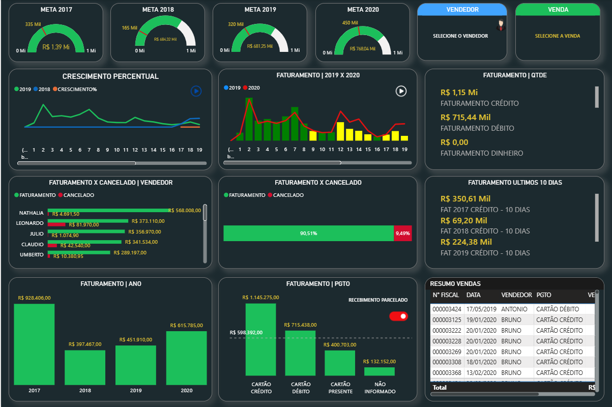
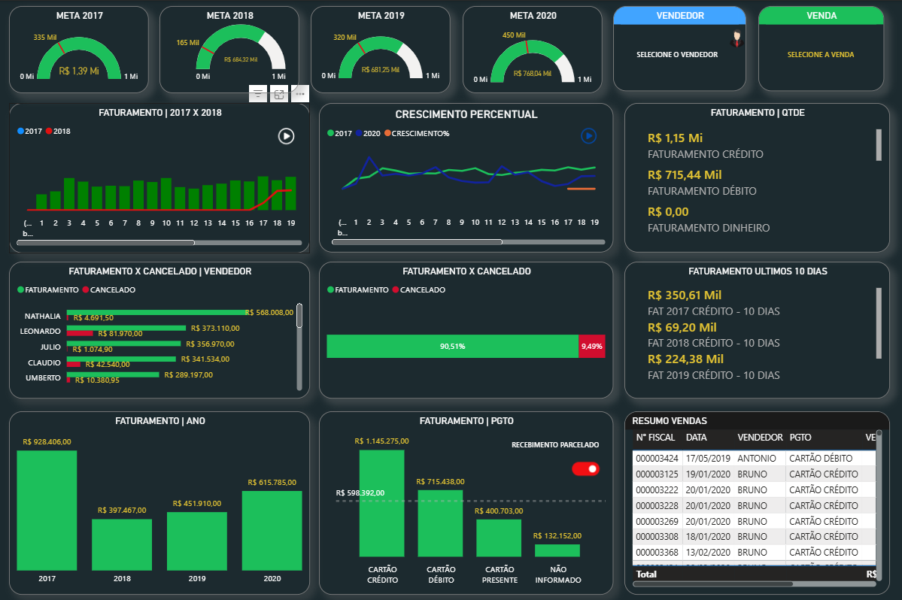
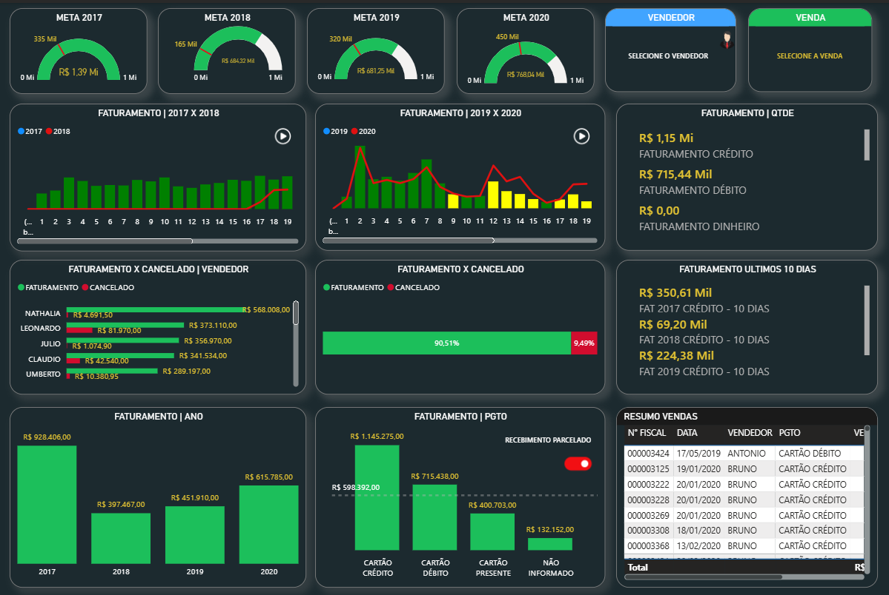

# 📊 Relatório de Vendas - Power BI

## 📌 Sobre o Projeto

Dashboard desenvolvido em Power BI para análise de vendas utilizando dados históricos de 2017, 2018, 2019 e 2020.

O projeto permite acompanhar indicadores de desempenho comercial, analisar o comportamento das vendas ao longo do tempo e obter insights estratégicos por meio de visualizações interativas.

---

## 📷 Dashboard

### Visão Geral

### Análise de Vendas

### Evolução das Vendas

---

## 📈 Indicadores Monitorados

* Faturamento Total
* Quantidade de Vendas
* Ticket Médio
* Evolução das Vendas
* Comparativo Anual
* Análise por Vendedor
* Análise por Forma de Pagamento

---

## 🛠️ Tecnologias Utilizadas

* Power BI
* Power Query
* DAX
* Microsoft Excel

---

## 📂 Arquivos do Projeto

| Arquivo                  | Descrição                                                   |
| ------------------------ | ----------------------------------------------------------- |
| RELATORIO DE VENDAS.pbix | Dashboard principal desenvolvido no Power BI                |
| meta_2017.xlsx           | Base de dados referente ao ano de 2017                      |
| meta_2018.xlsx           | Base de dados referente ao ano de 2018                      |
| meta_2019.xlsx           | Base de dados referente ao ano de 2019                      |
| meta_2020.xlsx           | Base de dados referente ao ano de 2020                      |
| DEPARA.txt               | Documento de mapeamento de vendedores e formas de pagamento |
| Imagens/                 | Capturas de tela utilizadas na documentação                 |

---

## 🔄 Processo de Tratamento dos Dados

1. Importação das bases Excel.
2. Padronização e limpeza dos dados utilizando Power Query.
3. Aplicação do arquivo DEPARA para identificação de vendedores e formas de pagamento.
4. Modelagem dos dados.
5. Criação de medidas e indicadores utilizando DAX.
6. Construção das visualizações e KPIs.

---

## 🚀 Competências Demonstradas

* Power BI
* Power Query
* DAX
* ETL
* Modelagem de Dados
* Visualização de Dados
* Análise de Indicadores
* Business Intelligence

---

## 👨‍💻 Autor

**Vinicius Souza Martins**

Estudante de Ciência de Dados com foco em Análise de Dados, Business Intelligence, SQL, Python e Power BI.

GitHub: https://github.com/DeSouzaVini
